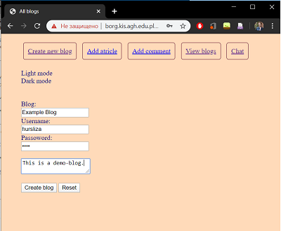
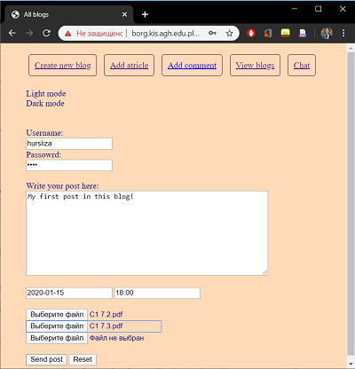
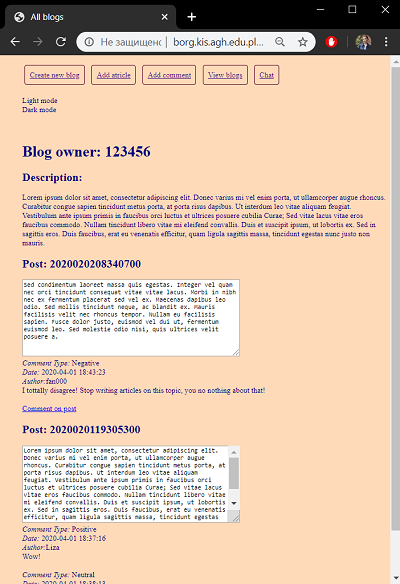

# Blog

An implementation of a primitive blog created for AGH UST course on Web languages and technologies.

## Functionality

The user can create a personal blog using a unique username and password.

Adding a post:

The other users can view the blogs and add comments to any post.

Also there is a built-in real-time chat:

## Technologies
* Server side
  *  PHP
  *  JavaScript
* Client side
  * HTML/CSS
